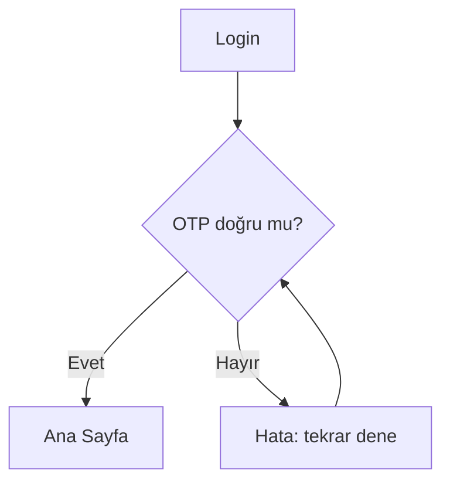

# <Uygulama> — <Akış Adı> Akışı

> **Künye** · Uygulama: `<uygulama>` · Akış: `<akış>` · Rol/ön koşul: `<rol>` · Ortam: `<dev/uat>` ·
> Sahip (analist): `<ad>` · Tarih: `<gg.aa.yyyy>` · Kanıt: ✅ canlı gözlendi

## Amaç & Kapsam
<Bu akış ne yapar, nerede başlar/biter. Kapsam dışı olanları da 1-2 madde yaz.>

## Ön Koşullar
- Giriş noktası: `<ekran/URL>`
- Gerekli rol/yetki: `<...>`
- Ön veri/durum: `<...>`

## Adım Tablosu
| # | Ekran | Kullanıcı Aksiyonu | Giriş Alanları (ad · tip · zorunlu · validasyon) | Sistem Yanıtı | API (gözlem) | Sonraki |
|---|-------|--------------------|--------------------------------------------------|---------------|--------------|---------|
| 1 | Login | Kullanıcı adı + parola gir (**analist yapar**) | kullanıcıAdı·text·zorunlu · parola·password·zorunlu | OTP ekranı | `POST /auth/login` | 2 |
| 2 | OTP | 6 haneli kod gir (**analist yapar**) | otp·text·zorunlu·6 hane | Ana sayfa / hata | `POST /auth/otp` | 3 / 2 |
| … |  |  |  |  |  |  |

## Karar / Dallanmalar
- **OTP başarısız:** `<ne olur, kaç deneme, kilit?>`
- **Validasyon hatası:** `<mesaj + davranış>`
- **Yetki yok:** `<...>`

## Akış Diyagramı

## Gözlemlenen API'ler
- `POST /auth/login` — `[K: Network:POST /auth/login]` · istek: `{kullanıcıAdı, parola}` (maskeli) · yanıt: `{otpGerekli:true}`
- `POST /auth/otp` — `[K: Network:POST /auth/otp]` · …

## Açık Sorular / Uç Durumlar
- ❓ `<belirsiz nokta — canlı teyit / analiste sor>`
- ⚠️ `<çıkarım olan, doğrulanmalı>`
